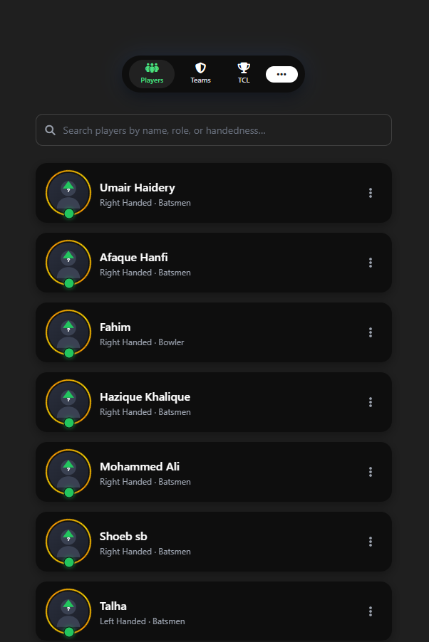
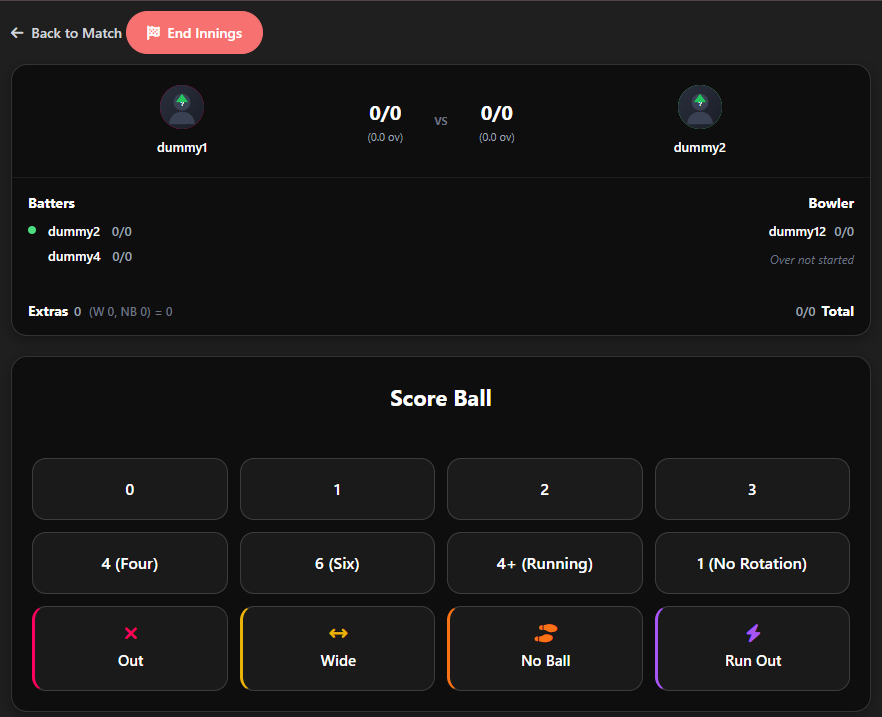
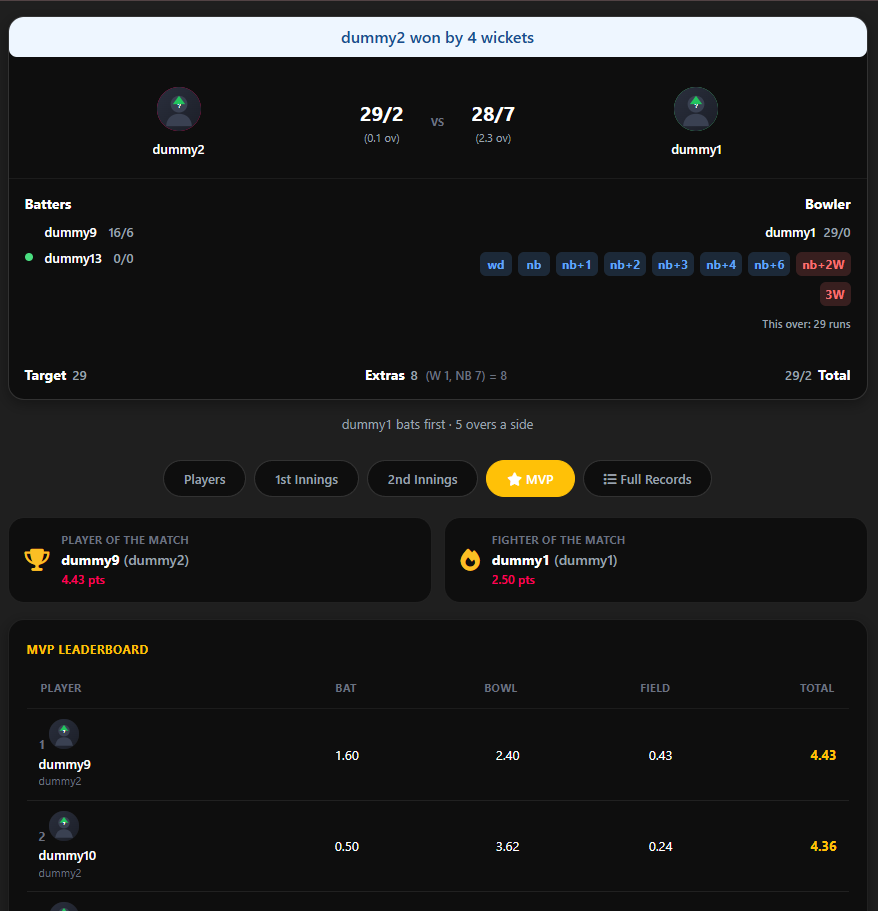
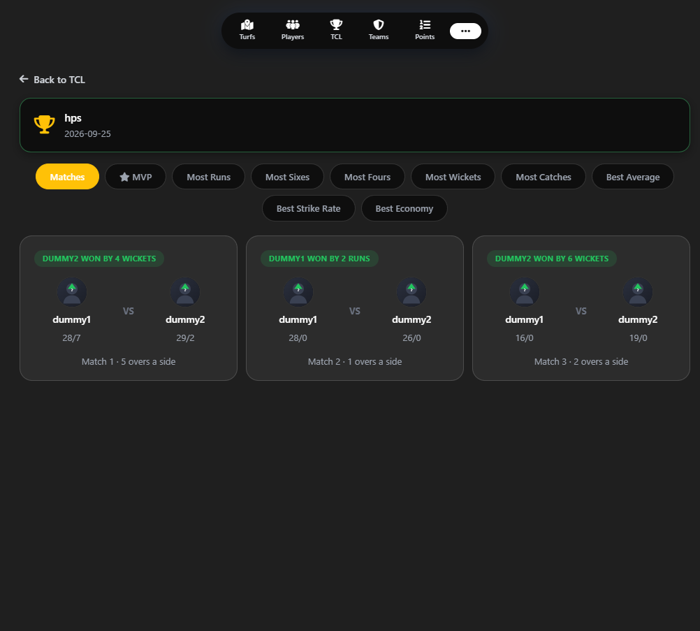
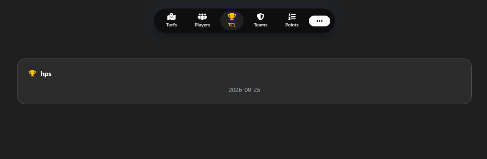
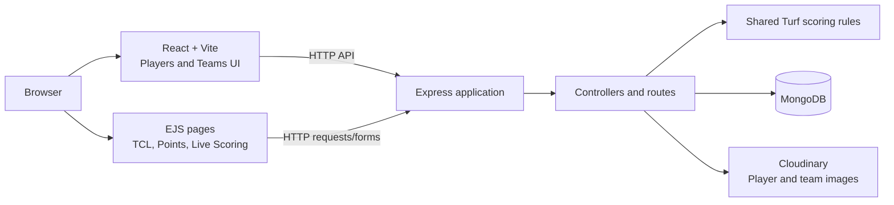

# Turf Cricket Manager

A full-stack web application for managing **Turf Cricket** players, teams, matches, and TCL tournaments. It combines player and team administration with live ball-by-ball scoring, scorecards, match records, player statistics, points tables, and MVP awards.

> **Built for Turf Cricket.** Scoring and match behavior follow this app's Turf Cricket format and are not intended to implement the laws or formats of international cricket.

## Overview

Administrators can create player profiles and teams, schedule normal Turf matches or TCL tournament fixtures, and score matches live from a browser. Public pages allow people to view players, teams, tournament fixtures, points, scorecards, and live match information.

Live scoring is designed to feel immediate: the browser applies a ball to the visible score first, then persists it to the backend through an ordered request queue. The server uses the shared scoring rules and remains the source of truth. If a save fails or the browser and server disagree, the page can resynchronize from the saved match state.

Player profiles preserve cumulative Turf statistics, including TCL performances. Match records can be removed when folders or tournaments are deleted, while completed match statistics are saved to profiles first. Match MVP is awarded per match; Turf MVP is awarded once for a complete Turf session or TCL tournament.

## Key Features

- **Player management:** profiles, images, roles, handedness, and career statistics.
- **Team management:** team rosters, logos, captain selection, and a player picker that promotes search matches without hiding the full player list.
- **Turf sessions:** create sessions, configure teams and overs, and manage multiple matches.
- **TCL tournaments:** create tournament folders, schedule fixtures, track match stages, and display tournament information.
- **Live scoring:** record Turf-format runs, boundaries, wides, no-balls, wickets, run-outs, retirements, and other supported scoring events.
- **Optimistic scoring UI:** score updates render immediately, while persistence requests are processed in order.
- **Shared scoring rules:** browser and server use the same rules module to reduce differences in score calculation.
- **Scorecards and Full Records:** view innings, player details, MVP information, and persisted ball-by-ball records grouped by innings and over.
- **Points and progression:** tournament points tables, playoff progression, and optional Super Overs where enabled for a TCL tournament.
- **Player statistics:** combined Turf career statistics include Turf and TCL performances; there is no separate TCL profile-stat block.
- **MVP awards:** Match MVP is awarded per match; Turf MVP is awarded once for the whole session/tournament.
- **Persistent history:** completed match statistics are aggregated before Turf sessions or TCL tournaments are deleted.
- **Single administrator session:** administrative operations require the shared admin login.
- **Image uploads:** player photos and team logos are uploaded to Cloudinary.

## Screenshots

### Players



### Live scoring



### Scorecard



### TCL tournament folder



### TCL



These images are embedded from the `docs/screenshots/` directory. Avoid including passwords, credentials, or private player information in screenshots.

## Architecture



- **React/Vite** provides the player and team management interfaces and communicates with the Express JSON APIs.
- **Express/EJS** serves the TCL, points, and live scoring experiences.
- **Controllers and route modules** implement application behavior and admin authorization.
- **MongoDB/Mongoose** stores players, teams, matches, Turf sessions, tournaments, and admin session state.
- **Shared scoring rules** are in `public/js/ballRules.js` and are used by browser scoring and the server.
- **Cloudinary** stores uploaded player and team images.

## Tech Stack

| Area | Technologies |
|---|---|
| Backend | Node.js, Express 5 |
| Database | MongoDB, Mongoose |
| Server-rendered UI | EJS |
| Client UI | React 18, React Router |
| Frontend tooling | Vite 5 |
| Uploads | Multer, Cloudinary |
| Styling and icons | CSS, Bootstrap 5, Font Awesome |
| Development server | Nodemon |

## Project Structure

```text
.
├── app.js                    # Express entry point and route mounting
├── config/
│   ├── db.js                 # MongoDB connection
│   └── cloudinary.js         # Cloudinary configuration
├── controllers/              # Page, API, scoring, tournament, and auth handlers
├── middlewares/              # Admin authorization and image upload handling
├── models/                   # Mongoose models for players, teams, matches, etc.
├── routes/                   # Express route definitions
├── utils/                    # Authentication, MVP calculation, and helpers
├── public/
│   ├── css/                  # Stylesheets
│   ├── js/                   # Live scoring, shared rules, MVP, and refresh scripts
│   ├── images/               # Public image assets
│   └── uploads/              # Locally served public uploads/assets, if used
├── views/                    # EJS pages and shared partials
├── client/
│   ├── src/                  # React application and components
│   ├── index.html
│   ├── vite.config.js
│   └── package.json
├── package.json              # Backend dependencies and commands
└── README.md
```

## Getting Started

### 1. Prerequisites

- Node.js 20 or newer
- npm
- MongoDB running locally or a MongoDB Atlas connection string
- Cloudinary account credentials for player/team image uploads
- Git

### 2. Clone the Repo

```bash
git clone https://github.com/<your-github-username>/<your-repository>.git
cd <your-repository>
```

Replace the URL and directory with your GitHub repository details.

### 3. Backend Setup

Install backend dependencies:

```bash
npm install
```

Create a `.env` file in the repository root:

```env
PORT=3000
MONGO_URL=mongodb://127.0.0.1:27017/cricket
ADMIN_PASSWORD=replace-with-a-strong-password
ADMIN_SECRET=replace-with-a-long-random-secret
SESSION_TIMEOUT_MINUTES=360

CLOUDINARY_CLOUD_NAME=your-cloud-name
CLOUDINARY_API_KEY=your-cloudinary-api-key
CLOUDINARY_API_SECRET=your-cloudinary-api-secret
```

For MongoDB Atlas, set `MONGO_URL` to your Atlas connection string instead. Keep `.env` private; it is excluded from Git. Use strong, unique values for `ADMIN_PASSWORD` and `ADMIN_SECRET`, especially outside local development. Cloudinary credentials are needed for image uploads.

Start the backend:

```bash
npm run dev
```

The server listens on `http://localhost:3000` by default. `npm start` runs the app without Nodemon.

### 4. Frontend Setup

The React client has its own dependencies. In another terminal:

```bash
cd client
npm install
```

For a production build served by Express:

```bash
npm run build
```

The build is written to `client/dist/`. Express uses this build for the `/players` and `/teams` React application routes. The EJS pages handle TCL, points, and live scoring.

For React development with Vite hot reload, run:

```bash
cd client
npm run dev
```

Vite runs on port `5173` and proxies configured API, authentication, and static requests to the backend at `http://localhost:3000`. Keep the backend running in a separate terminal.

### 5. Try It

1. Start MongoDB and the backend.
2. Build the React client, or run Vite separately for frontend development.
3. Open `http://localhost:3000/players` for player management, or visit `/teams`, `/turfs`, or `/tcl`.
4. Log in as the administrator to create or edit players, teams, matches, and tournaments.
5. Create player profiles and teams.
6. Create a Turf session or TCL tournament, then schedule and score a match.
7. Open player profiles to see saved cumulative statistics and MVP counts.

The admin password is read from `ADMIN_PASSWORD`. Public pages can be viewed without admin access; administrative actions require login.

### 6. API Reference

All endpoints are served by the Express backend. Administrative write actions require an active admin session; player/team list and detail reads are public.

| Method | Endpoint | Purpose |
|---|---|---|
| `GET` | `/status` | Check current admin status |
| `POST` | `/login` | Start admin session |
| `POST` | `/logout` | End admin session |
| `GET` | `/api/players` | List players |
| `GET` | `/api/players/:id` | Fetch a player |
| `POST` | `/api/players` | Create player (admin) |
| `POST` | `/api/players/:id/edit` | Update player |
| `POST` | `/api/players/:id/delete` | Delete player (admin) |
| `GET` | `/api/teams` | List teams |
| `GET` | `/api/teams/:id` | Fetch a team |
| `POST` | `/api/teams` | Create team (admin) |
| `POST` | `/api/teams/:id/edit` | Update team (admin) |
| `POST` | `/api/teams/:id/delete` | Delete team (admin) |
| `GET` | `/api/turfs` | Load Turf data (admin API) |
| `POST` | `/api/turfs/*` | Turf actions (admin) |
| `GET` | `/tcl` | List TCL tournaments |
| `GET` | `/tcl/session/:id` | View tournament and matches |
| `POST` | `/tcl/create` | Create tournament (admin) |
| `POST` | `/tcl/session/:id/match` | Schedule match (admin) |
| `POST` | `/tcl/session/:id/turf-mvp` | Award tournament Turf MVP (admin) |
| `GET` | `/points` | View points information |
| `GET` | `/turfs/live/:id` | View live match and scorecard |
| `POST` | `/turfs/live/:id/ball` | Record a ball (admin) |
| `POST` | `/turfs/live/:id/undo` | Undo last ball (admin) |
| `POST` | `/turfs/live/:id/end` | End match (admin) |

The complete Turf scoring routes are defined in `routes/turf.routes.js`; tournament routes are in `routes/tcl.routes.js`. Form uploads use multipart form data. Player images and team logos accept JPG, PNG, or WEBP up to 2 MB.

### 7. Deployment

This is a provider-neutral deployment checklist:

1. Provision a Node.js 20+ runtime and a MongoDB database.
2. Configure the production environment variables listed in Backend Setup.
3. Use a strong `ADMIN_PASSWORD` and a long random `ADMIN_SECRET`; do not rely on development defaults.
4. Configure MongoDB network access to allow the deployed backend, and keep database credentials private.
5. Configure Cloudinary credentials for image uploads.
6. Install dependencies and build the React client:

   ```bash
   npm ci
   cd client
   npm ci
   npm run build
   cd ..
   ```

7. Start the backend with:

   ```bash
   npm start
   ```

8. Set the host's `PORT` environment variable if it assigns a port dynamically.
9. Verify admin login, player/team image uploads, live scoring, statistics, and tournament workflows after deployment.
10. Back up MongoDB regularly and use HTTPS in production.

Do not commit `.env`, database credentials, Cloudinary secrets, or real player data/screenshots to a public repository.

### 8. Roadmap

- Add real, privacy-safe application screenshots to the README.
- Add automated tests for Turf scoring rules, ball-record wording, undo, and innings transitions.
- Add integration tests for player-stat aggregation, deletion persistence, and duplicate MVP protection.
- Add end-to-end checks for creating and scoring Turf/TCL matches.
- Improve observability for scoring failures and database errors.
- Review accessibility and responsive behavior across admin and viewer pages.
- Consider live spectator broadcasting or caching only if future traffic measurements justify it.

## Development Notes

- `npm test` is currently a placeholder and does not run a test suite.
- Turf scoring behavior is specific to the application's Turf Cricket rules.
- MongoDB is the source of truth for matches and player profiles.
- `turfStats` is the combined Turf + TCL career record.
- Match MVP is per match; Turf MVP is per complete session or tournament.
- Redis is not required for the current single-admin scoring workflow.
